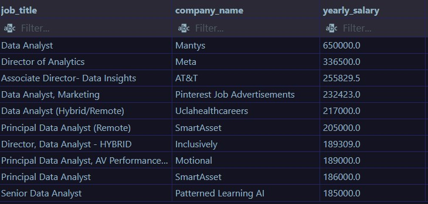
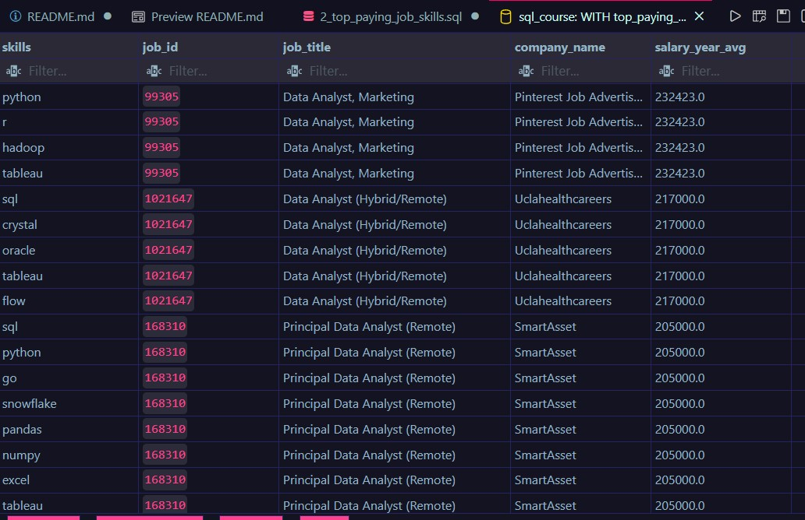
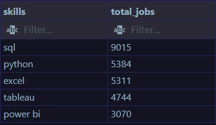
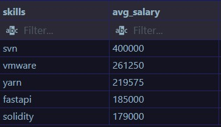
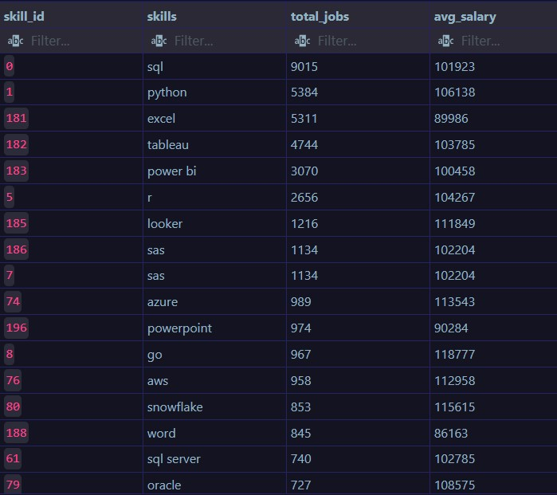

# Introduction
Understanding the job market and skill requirements for high-paying and high-demand jobs, especially Data Analyst roles.
This project uses SQL to explore job postings, analyze salaries, and identify the most in-demand skills 📊✨.
Interested in queries?? check tem out here --> [project_sql](/project_sql/)
# Tools I Used
For my analysis, I used the tools stated below:

- **SQL** : The core of the analysis, used for writing different queries to answer specific data-related questions.
- **PostgreSQL** : The database management system I used for handling my job market data.
- **VS Code** : My go-to tool for database management and executing SQL queries.
- **Git & GitHub** : Essential for version control, project tracking, and sharing work publicly. 🚀📊

# The Analysis
The analysis is a deep dive into the database to get answers to 5 different questions. The questions are focused on top in-demand skills, high-paying jobs, whether the jobs are work from home or not, and most importantly, Data Analyst roles.
#### **1.Top paying Data Analyst jobs?**

To answer this specific question, I first filtered the data to get only Data Analyst jobs, then sorted them by salaries to find the highest paying Data Analyst jobs.

```sql
SELECT 
    job_title,
    company_dim.name AS company_name,
    salary_year_avg AS yearly_salary,
    job_schedule_type,
    job_posted_date AS posted_date
FROM 
    job_postings_fact 
LEFT JOIN 
    company_dim
ON
    job_postings_fact.company_id=company_dim.company_id
WHERE 
    job_title_short LIKE '%Data Analyst%' AND job_location ='Anywhere' AND salary_year_avg IS NOT NULL 
ORDER BY
    salary_year_avg DESC
LIMIT 10;    
```


* *The result of this query gives us data about Data Analyst jobs salaries,The salary range is between 180000-650000, Highest salary is 650000 and lowest is 185000 for top 10 high-paying jobs.* 
### **2.skills associated with top paying jobs?**
In this question we are focusing on finding the skills that are required in high paying jobs.I used the previous query_1 as a CTE for the data regarding top paying jobs and then used INNER JOIN(s) to join the result with skill_dim table and retrieve the skill names.

```sql
WITH top_paying_jobs AS(
    SELECT 
        job_id,
        job_title,
        company_dim.name AS company_name,
        salary_year_avg 
        
    FROM 
        job_postings_fact 
    LEFT JOIN 
        company_dim
    ON
        job_postings_fact.company_id=company_dim.company_id
    WHERE 
        job_title_short LIKE '%Data Analyst%' AND job_location ='Anywhere' AND salary_year_avg IS NOT NULL 
    ORDER BY
        salary_year_avg DESC
    LIMIT 10
)


SELECT skills,
    top_paying_jobs.*
FROM top_paying_jobs
INNER JOIN skills_job_dim ON top_paying_jobs.job_id=skills_job_dim.job_id
INNER JOIN skills_dim ON skills_job_dim.skill_id=skills_dim.skill_id
ORDER BY
    salary_year_avg DESC

```

* *Here we can see there are 3 different job_id , and each job_d id has multiple skill requirements.This data shows us what are the skills requirement in top paying jobs and we can see that SQL and Python are most important skills for any job seeker to develop and get a high paying job. Other skills like tableau , pandas , numpy , excel are amoung some frequently demanded skills.* 

### **3.top demanded skill?**
In this query we deep dive in jobs fact data to know what are the top 5 skills that are important based on there requirements/demand in jobs.

```sql
SELECT skills_dim.skills , count(skills_job_dim.job_id) AS total_jobs
FROM 
    job_postings_fact
INNER JOIN skills_job_dim ON job_postings_fact.job_id=skills_job_dim.job_id
INNER JOIN skills_dim ON skills_job_dim.skill_id=skills_dim.skill_id
WHERE
    job_title_short LIKE '%Data Analyst%' AND job_location = 'Anywhere'
GROUP BY skills_dim.skills
ORDER BY total_jobs DESC
LIMIT 5
```




*  *This result directly tell us that SQL is required for about 9000+ jobs and Python , Excel , Tableau , Power BI are required for 3000-5000 jobs. That similar to the conclusion we made with last query but it's more accurate and factual.* 

### **4.top skills based on salaries?**
This focuses on getting details about top 5 skills based on salaries only , average yearly salary is considered , Only NON NULL salaries.
```SQL
SELECT skills_dim.skills , 
    ROUND(AVG(salary_year_avg)) AS avg_salary
FROM 
    job_postings_fact
INNER JOIN skills_job_dim ON job_postings_fact.job_id=skills_job_dim.job_id
INNER JOIN skills_dim ON skills_job_dim.skill_id=skills_dim.skill_id
WHERE
    job_title_short LIKE '%Data Analyst%' AND salary_year_avg IS NOT NULL
GROUP BY 
    skills_dim.skills
ORDER BY
    avg_salary DESC
LIMIT 5
```


* *This result shows the top 5 skills based on the salary.Being the highest paid skill SVN has a average salary of 400000.* 

### **5.optimal skills**
This query is sort of a conclusion to all the questions where we revolve around top skills , high paying jobs , skills by demand... , This query results with a single Table that shows skills their demand in job postings , salaries associated to those skills all in one structured Tabular form.
```sql
WITH high_paying_skills AS(
    SELECT skills_dim.skill_id,
        skills_dim.skills , 
        ROUND(AVG(salary_year_avg)) AS avg_salary
    FROM 
        job_postings_fact
    INNER JOIN skills_job_dim ON job_postings_fact.job_id=skills_job_dim.job_id
    INNER JOIN skills_dim ON skills_job_dim.skill_id=skills_dim.skill_id
    WHERE
        job_title_short LIKE '%Data Analyst%' AND salary_year_avg IS NOT NULL AND job_work_from_home = True
    GROUP BY 
        skills_dim.skill_id

), high_demand_skills AS (
    SELECT skills_dim.skill_id, skills_dim.skills , count(skills_job_dim.job_id) AS total_jobs
    FROM 
        job_postings_fact
    INNER JOIN skills_job_dim ON job_postings_fact.job_id=skills_job_dim.job_id
    INNER JOIN skills_dim ON skills_job_dim.skill_id=skills_dim.skill_id
    WHERE
        job_title_short LIKE '%Data Analyst%' AND job_location = 'Anywhere'
    GROUP BY skills_dim.skill_id
)


SELECT 
    high_paying_skills.skill_id,
    high_demand_skills.skills,
    high_demand_skills.total_jobs,
    high_paying_skills.avg_salary
FROM 
    high_paying_skills
INNER JOIN high_demand_skills ON high_paying_skills.skill_id=high_demand_skills.skill_id
ORDER BY total_jobs DESC, avg_salary DESC
LIMIT 25
```

* *The results indicate that SQL is the most in-demand skill; however, its salary is not as high as that of other skills. Despite this, it remains the most sought-after skill.*
# What I Learned
- While working on this project, I learned how to use data creatively and draw meaningful insights from it.
- Handling complex queries: Functions like GROUP BY, WHERE, and HAVING were a bit challenging at first, but I’ve learned to handle them fairly well.
- Aggregation & conditions: Applying aggregation or conditions is relatively easy, but understanding when to use aggregation versus when to use conditions requires practice.
- Database management & Git/GitHub: Using PostgreSQL and VS Code, managing databases has been smooth and enjoyable. Using Git for version control and showcasing my project has also been an interesting experience.
# Conclusions
- **During this project, I refined my SQL skills and learned several new concepts. It significantly improved my confidence in writing and executing queries, managing databases, and working with data hosted on real-world database systems.**